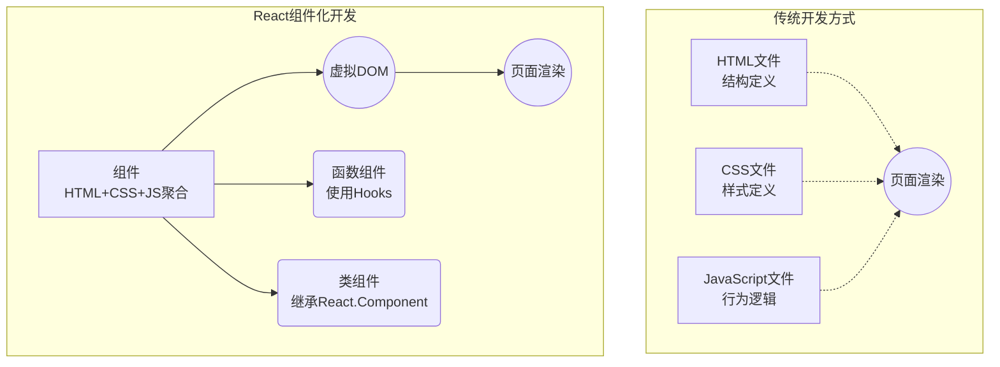

---
{
  "title": "初次渲染",
  "date": "2025-03-30",
  "description": "DOM初次渲染",
  "tag": ["React源码"],
  "recommend": 3,
}
---

# 初次渲染流程

## DOM append

- 虚拟 DOM 最终要转换成真实 DOM，是一个递归的插入过程，其他的就是数据的处理，实现方式很多种
  - 注意 JSX 处理后返回的值和节点的 children 的处理，分为 `ReactElement`(JSXElement,FunctionComponent、ClassComponent、ForwardRef 等等)、和`基础JavaScript类型`的值两大类来处理
  - 还有就是注意数组类型的处理

```js
function render(virtualDOM, container) {
  mount(virtualDOM, container);
}
function mount(virtualDOM, container) {
  if (Array.isArray(virtualDOM)) {
    return mountArray(virtualDOM, container);
  }
  const realDOM = createDOM(virtualDOM);
  realDOM && container.appendChild(realDOM);
}
function createDOM(virtualDOM) {
  if (virtualDOM === null || virtualDOM === undefined) return;
  let realDOM = null;

  const isReactElement = REACT_ELEMENT_LIST.includes(virtualDOM.$$typeof);

  if (isReactElement) {
    const { type, props, ref } = virtualDOM;

    if (typeof type === "function" && type.IS_CLASS_COMPONENT) {
      realDOM = getClassComponent(virtualDOM);
    } else if (
      typeof type === "function" &&
      type.$$typeof === REACT_FORWARD_REF
    ) {
      realDOM = getForwardRefComponent(virtualDOM);
    } else if (typeof type === "function") {
      realDOM = getFunctionComponent(virtualDOM);
    } else {
      realDOM = document.createElement(type, props);
    }
    if (Array.isArray(props?.children)) {
      mountArray(props.children, realDOM);
    } else {
      mount(props?.children, realDOM);
    }
    setProps(realDOM, props);

    ref && (ref.current = realDOM);
  } else {
    const actualType = typeof virtualDOM;
    if (
      actualType === "bigint" ||
      actualType === "symbol" ||
      (actualType === "object" && !Array.isArray(virtualDOM)) ||
      actualType === "function" ||
      actualType === "boolean"
    ) {
      return null;
    }

    // number | string | any
    realDOM = document.createTextNode(virtualDOM);
  }

  return realDOM;
}
function mountArray(virtualDOM, container) {
  virtualDOM.forEach((item) => {
    mount(item, container);
  });
}
```

## 元素 Props 处理

- 处理 DOM 的属性，事件，样式等需要特殊处理

```js
function setProps(realDOM, props) {
  if (!realDOM || !props) return;
  Object.keys(props).forEach((key) => {
    if (key === "children") return;
    else if (key === "style") {
      Object.keys(props.style).forEach((styleKey) => {
        realDOM.style[styleKey] = props.style[styleKey];
      });
    } else if (/^on[A-Z].*/.test(key)) {
      addEvent(realDOM, key.toLowerCase(), props[key]);
    } else realDOM[key] = props[key];
  });
}
```

## 组件

组件是 React 应用中的核心构建块。它们是独立、可重用的代码片段，负责描述界面的某一部分。组件可以是类组件，也可以是函数组件。组件可以接收称为 "props" 的输入，返回描述 UI 的 React 元素。

### 传统开发与组件化开发对比

在传统的前端开发中，一个功能模块通常需要分散在 HTML、CSS 和 JS 三个不同的文件中编写，这种分离使得代码难以复用，当需要在其他地方使用类似功能时，往往需要复制大量代码。而且，状态管理和 DOM 操作通常是命令式的，这使得代码更加复杂且难以维护。

相比之下，React 的组件化方式将相关的标记、样式和逻辑聚合在一起，形成独立、可重用的单元。这种方式使得代码更加模块化，便于维护和扩展。组件可以接收参数（props），有自己的状态（state），并能以声明式的方式描述 UI，大大简化了前端开发。



在 React 中，组件主要分为两种类型：

### 函数组件

这里还没有提到 hooks 的使用，函数组件其实就是纯函数，接收 props，返回 react 元素,也被称为渲染组件

- 将 props 传递给组件，执行组件函数，返回 react 元素

```js
function getFunctionComponent(virtualDOM) {
  const { type, props } = virtualDOM;
  const renderVNode = type(props);
  if (!renderVNode) return;

  return createDOM(renderVNode);
}
```

### 类组件
